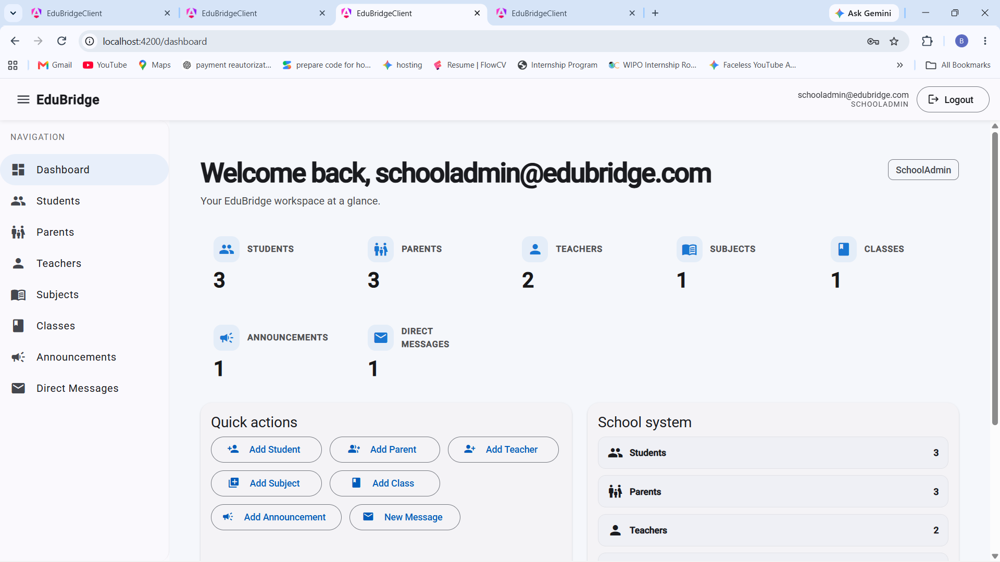
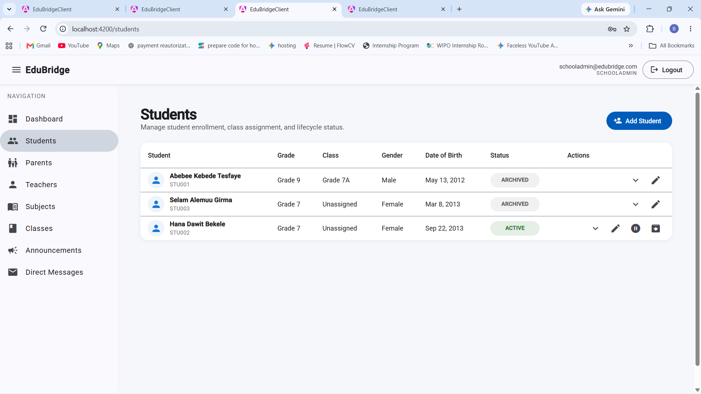
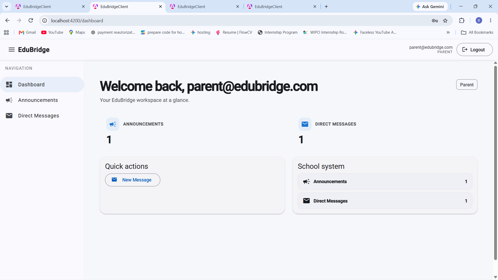
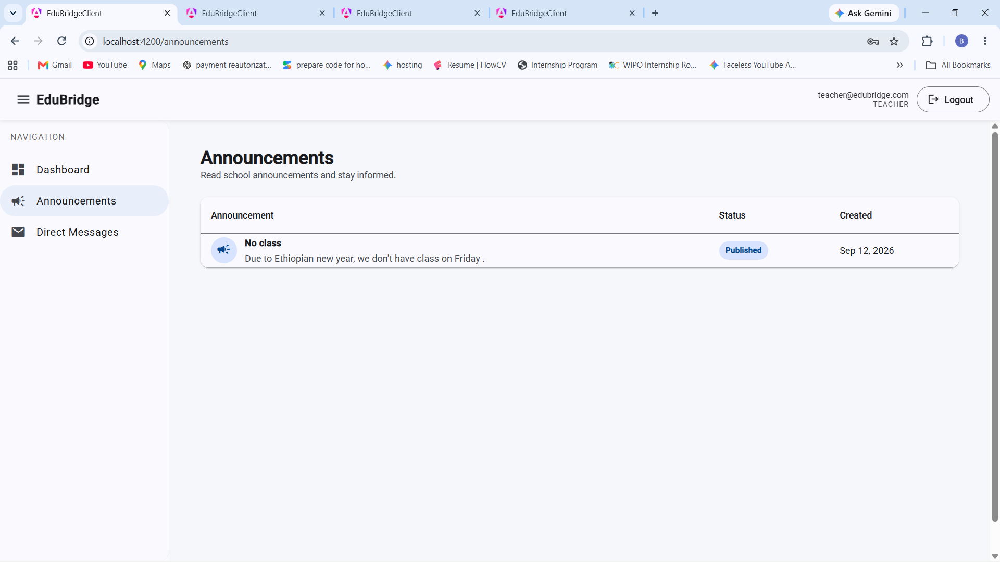

# EduBridge Client

EduBridge Client is the Angular frontend for **EduBridge**, a multi-tenant school management platform designed for private schools in Ethiopia from KG through Grade 12.

The application provides role-aware dashboards and interfaces for managing schools, students, teachers, parents, classes, subjects, announcements, and direct messages while communicating with the EduBridge ASP.NET Core REST API.

> **Backend repository:** `Beenat7/EduBridge`

---

## Overview

EduBridge Client provides a modern web interface for the EduBridge platform.

The frontend is built with **Angular 21** using standalone components and communicates with the EduBridge backend through REST APIs.

The application supports different experiences based on the authenticated user's role:

* **PlatformAdmin** — platform-level school management
* **SchoolAdmin** — school management and administrative operations
* **Teacher** — teacher-focused access to school information and communication
* **Parent** — parent-focused access to announcements and communication

Role-based navigation and route protection are handled on the client side, while the backend remains responsible for enforcing authorization.

---

## Features

### Authentication

* Login with backend JWT authentication
* Authentication state management
* Protected routes
* Role-based route guards
* HTTP authentication interceptor
* Authenticated API requests

### Dashboard

The dashboard adapts its available navigation and actions based on the authenticated user's role.

### School Management

* View schools
* Add schools
* Edit schools
* School administration interfaces
* PlatformAdmin and SchoolAdmin access

### Student Management

* View students
* Add students
* Edit students
* Student information management

### Parent Management

* View parents
* Add parents
* Edit parents
* Parent information management

### Teacher Management

* View teachers
* Add teachers
* Edit teachers
* Teacher information management

### Class Management

* View classes
* Add classes
* Edit classes
* Class information management

### Subject Management

* View subjects
* Add subjects
* Edit subjects
* Subject information management

### Announcements

* View announcements
* Create announcements
* Edit announcements
* Publish announcements
* Archive announcements
* Role-aware read-only access for teachers and parents

School administrators can manage announcements, while teachers and parents can access published announcement information without administrative actions.

### Direct Messaging

* View direct messages
* Send messages
* Message management interface
* Role-based access to communication features

---

## Technology Stack

| Technology          | Purpose                          |
| ------------------- | -------------------------------- |
| Angular 21          | Frontend framework               |
| TypeScript 5.9      | Application programming language |
| Angular Router      | Client-side routing              |
| Angular Forms       | Form handling and validation     |
| Angular Material 21 | UI components                    |
| Angular CDK 21      | UI and component utilities       |
| RxJS 7.8            | Reactive programming             |
| Vitest 4            | Unit testing                     |
| Prettier 3          | Code formatting                  |
| npm 11              | Package management               |

---

## Architecture

The frontend follows a feature-oriented Angular structure.

```text
src/
└── app/
    ├── auth/
    ├── config/
    ├── features/
    ├── models/
    └── services/
```

### Authentication

```text
auth/
├── auth.guard.ts
├── auth.interceptor.ts
├── auth.models.ts
├── auth.service.ts
└── role.guard.ts
```

This area contains authentication and authorization-related functionality.

* `auth.service.ts` — authentication operations and user authentication state
* `auth.guard.ts` — protects authenticated routes
* `role.guard.ts` — protects routes based on user roles
* `auth.interceptor.ts` — handles authentication information for API requests
* `auth.models.ts` — authentication-related TypeScript models

### Configuration

```text
config/
└── api.config.ts
```

Contains frontend configuration related to communication with the EduBridge backend API.

## Screenshots

**### School Admin Dashboard**




**### Schools — Platform Admin**


**### Students — School Admin**



**### Parent Dashboard**



**### Announcements — Teacher**



### Features

Each major application area is organized as its own feature.

```text
features/
├── announcement-form/
├── announcements/
├── app-shell/
├── class-form/
├── classes/
├── dashboard/
├── direct-message-form/
├── direct-messages/
├── login/
├── parent-form/
├── parents/
├── school-form/
├── schools/
├── student-form/
├── students/
├── subject-form/
├── subjects/
├── teacher-form/
└── teachers/
```

The application uses separate list and form features where appropriate.

For example:

```text
students/
├── students.html
├── students.scss
└── students.ts

student-form/
├── student-form.html
├── student-form.scss
└── student-form.ts
```

This keeps feature-specific UI and logic together and makes the application easier to maintain.

### Models

```text
models/
├── announcement.model.ts
├── class.model.ts
├── direct-message.model.ts
├── parent.model.ts
├── school.model.ts
├── student.model.ts
├── subject.model.ts
└── teacher.model.ts
```

The model files define the TypeScript representations used by the frontend when working with backend API data.

### Services

```text
services/
├── announcement.service.ts
├── class.service.ts
├── direct-message.service.ts
├── parent.service.ts
├── school.service.ts
├── student.service.ts
├── subject.service.ts
└── teacher.service.ts
```

Each service handles API communication for its corresponding feature.

This keeps HTTP/API logic separate from UI components.

---

## Project Structure

```text
EduBridge-Client/
│
├── public/
│
├── src/
│   └── app/
│       ├── auth/
│       │   ├── auth.guard.ts
│       │   ├── auth.interceptor.ts
│       │   ├── auth.models.ts
│       │   ├── auth.service.ts
│       │   └── role.guard.ts
│       │
│       ├── config/
│       │   └── api.config.ts
│       │
│       ├── features/
│       │   ├── announcement-form/
│       │   ├── announcements/
│       │   ├── app-shell/
│       │   ├── class-form/
│       │   ├── classes/
│       │   ├── dashboard/
│       │   ├── direct-message-form/
│       │   ├── direct-messages/
│       │   ├── login/
│       │   ├── parent-form/
│       │   ├── parents/
│       │   ├── school-form/
│       │   ├── schools/
│       │   ├── student-form/
│       │   ├── students/
│       │   ├── subject-form/
│       │   ├── subjects/
│       │   ├── teacher-form/
│       │   └── teachers/
│       │
│       ├── models/
│       │   ├── announcement.model.ts
│       │   ├── class.model.ts
│       │   ├── direct-message.model.ts
│       │   ├── parent.model.ts
│       │   ├── school.model.ts
│       │   ├── student.model.ts
│       │   ├── subject.model.ts
│       │   └── teacher.model.ts
│       │
│       ├── services/
│       │   ├── announcement.service.ts
│       │   ├── class.service.ts
│       │   ├── direct-message.service.ts
│       │   ├── parent.service.ts
│       │   ├── school.service.ts
│       │   ├── student.service.ts
│       │   ├── subject.service.ts
│       │   └── teacher.service.ts
│       │
│       ├── app.config.ts
│       ├── app.html
│       ├── app.routes.ts
│       ├── app.scss
│       ├── app.spec.ts
│       └── app.ts
│
├── angular.json
├── package.json
├── package-lock.json
├── tsconfig.json
└── README.md
```

---

## Prerequisites

Before running the frontend, install:

* Node.js
* npm
* A running EduBridge backend API

The project currently uses:

```text
Angular CLI: 21.2.19
Angular: 21.2.x
Node.js: 22.x
npm: 11.4.2
TypeScript: 5.9.x
```

The backend must also be configured and running because the frontend communicates with the EduBridge API.

Backend repository:

```text
Beenat7/EduBridge
```

---

## Getting Started

### 1. Clone the repository

```bash
git clone https://github.com/Beenat7/EduBridge-Client.git
cd EduBridge-Client
```

### 2. Install dependencies

```bash
npm install
```

### 3. Start the development server

```bash
ng serve
```

The Angular development server will normally be available at:

```text
http://localhost:4200
```

### 4. Start the backend

Run the EduBridge ASP.NET Core API separately.

The frontend's API configuration should point to the running backend API.

---

## Available Scripts

### Development server

```bash
ng serve
```

Starts the Angular development server.

### Production build

```bash
npm run build
```

Builds the application for production.

### Development build/watch

```bash
npm run watch
```

Rebuilds the application automatically when source files change.

### Tests

```bash
npm test
```

Runs the project's test suite.

---

## Authentication

EduBridge Client uses the authentication system provided by the EduBridge backend.

The frontend contains:

* Authentication service
* Authentication guard
* Role guard
* Authentication interceptor
* Login interface
* Authentication models

The general authentication flow is:

```text
User
  │
  ▼
Login Page
  │
  ▼
Auth Service
  │
  ▼
EduBridge API
  │
  ▼
JWT Authentication
  │
  ▼
Authenticated Application
  │
  ├── PlatformAdmin
  ├── SchoolAdmin
  ├── Teacher
  └── Parent
```

The backend remains the source of truth for authentication and authorization. Frontend guards improve navigation and user experience but should not be considered a security boundary by themselves.

---

## Role-Based Access

The application provides different navigation and actions depending on the authenticated user's role.

### PlatformAdmin

Platform-level access including school management.

### SchoolAdmin

Administrative access to school-related features such as:

* Students
* Teachers
* Parents
* Classes
* Subjects
* Announcements
* School information
* Communication features

### Teacher

Teacher-focused access to available school information and communication features.

Teachers can view announcements without administrative announcement actions.

### Parent

Parent-focused access to available school information and communication features.

Parents can view announcements without administrative announcement actions.

---

## API Communication

The frontend separates API communication into feature-specific services.

For example:

```text
SchoolService
     │
     ▼
Schools API

StudentService
     │
     ▼
Students API

TeacherService
     │
     ▼
Teachers API

ParentService
     │
     ▼
Parents API

AnnouncementService
     │
     ▼
Announcements API
```

This separation keeps API communication out of the presentation components and makes individual features easier to maintain.

---

## Development Guidelines

When adding a new feature:

1. Create the feature inside `src/app/features/`.
2. Create or update its model inside `src/app/models/`.
3. Create a dedicated API service inside `src/app/services/`.
4. Add the required route in `app.routes.ts`.
5. Apply authentication or role protection where required.
6. Keep API communication inside services rather than directly inside templates.
7. Run the application and verify the feature.
8. Run tests when applicable.
9. Commit changes using a descriptive conventional commit.

Example:

```bash
git add .
git commit -m "feat: add class management"
```

---

## Testing

The project uses **Vitest** for testing.

Existing test files include tests for selected application components such as:

```text
app.spec.ts
school-form.spec.ts
schools.spec.ts
student-form.spec.ts
students.spec.ts
```

Run tests with:

```bash
npm test
```

---

## Current Scope

The current frontend focuses on the core school-management experience required for the EduBridge project.

Implemented areas include:

* Authentication
* Role-aware navigation
* Dashboard
* School management
* Student management
* Teacher management
* Parent management
* Class management
* Subject management
* Announcements
* Direct messaging
* Protected routes
* Role-based route access
* Backend API integration

---

## Future Improvements

Potential future improvements include:

* Parent self-registration and school approval workflow
* Academic-year management
* Student academic history
* Attendance management
* More detailed dashboards and reporting
* Expanded parent/student relationships
* Real-time messaging and notifications
* Additional form validation and user feedback
* Improved automated test coverage
* Production deployment configuration
* Accessibility improvements
* Responsive UI refinements

---

## Related Project

### EduBridge Backend

The Angular application communicates with the EduBridge ASP.NET Core backend.

```text
Backend:
Beenat7/EduBridge

Frontend:
Beenat7/EduBridge-Client
```

The backend provides:

* ASP.NET Core REST API
* JWT authentication
* Role-based authorization
* Entity Framework Core
* PostgreSQL
* Clean Architecture
* Scalar API documentation

---

## Author

**Beenatlay Nigussie**

GitHub: [Beenat7](https://github.com/Beenat7) 